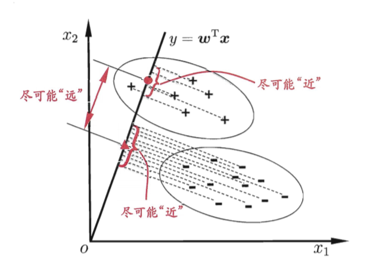

# 第3章 线性模型

## 3.1 基本形式

给定由$d$个属性描述的示例$\boldsymbol{x}=(x_1;x_2;\ldots;x_d)$。

线性模型（Linear Model | LM）试图学得一个属性线性组合的预测模型，即
$$
f(\boldsymbol{x})=w_1x_1+w_2x_2+\cdots+w_dx_d+b
$$
向量形式
$$
f(\boldsymbol{x})=\boldsymbol{w}^\rm{T}\boldsymbol{x}+b
$$

* 线性模型形式简单、易于建模
* 许多功能更为强大的非线性模型，可以在星型模型基础上，通过引入层级结构或高位映射而得
* $\boldsymbol{w}$直观表达各个属性的重要性，LM具有很好的可解释性（comprehensibility）

## 3.2 线性回归 （Linear Regression）

**模型目标**

试图学得$ f(\boldsymbol{x_i})=\boldsymbol{w}^\rm{T}\boldsymbol{x_i}+b $，使得$ f(\boldsymbol{x_i})\simeq y_i $

**最小二乘法**

令
$$
\hat{y_i}=f(\boldsymbol{x_i})=\boldsymbol{w}^T \boldsymbol{x_i}+b
$$

$$
\boldsymbol{\hat{w}}=(w_1,w_2,\dots,w_d,b)^T
$$

$$
\boldsymbol{\tilde{x_i}}=(x_{i1},x_{i2},\dots,x_{id},1)^T
$$

$$
\boldsymbol{y}=(y_1,y_2,\dots,y_m)
$$

$$
X=\begin{pmatrix}x_{11} &x_{12} &\dots & x_{1d} & 1 \\ x_{21} &x_{22} &\dots &x_{2d} & 1 \\ \vdots &\vdots & \ddots &\vdots &\vdots \\ x_{m1} & x_{m2} &\dots &x_{md} & 1 \end{pmatrix}= \begin{pmatrix}\boldsymbol{x_1^T} &1 \\ \boldsymbol{x_2^T} &1 \\  \vdots & \vdots \\\boldsymbol{x_m^T} &1 \\  \end{pmatrix}
$$

则有
$$
f(\boldsymbol{x_i})=\boldsymbol{w}^\rm{T}\boldsymbol{x_i}+b=\boldsymbol{\hat{w}}^T\boldsymbol{\tilde{x_i}}
$$

定义损失函数 
$$
\begin{equation}
\begin{split}
L(f) &=\sum_{i=1}^N (\hat{y_i}-y_i)^2 \\
&=\sum_{i=1}^N (\boldsymbol{w}^T \boldsymbol{x_i}+b-y_i)^2 \\
&=(\boldsymbol{y}-\boldsymbol{\hat{w}}^T\boldsymbol{X})^T(\boldsymbol{y}-\boldsymbol{\hat{w}}^T\boldsymbol{X})
\end{split}
\end{equation}
$$
则目标
$$
\boldsymbol{\hat{w}}^*=\underset{\boldsymbol{\hat{w}}}{\arg\min} L(f)
$$
对$\hat{\boldsymbol{w}}  $求导
$$
\begin{equation}
\begin{split}
\def\Q#1#2{\frac{\partial#1}{\partial #2}}
\def\P{\boldsymbol{y}-\boldsymbol{\hat{w}}^T\boldsymbol{X}}
\Q{E_{\boldsymbol{\hat{w}}}}{\boldsymbol{\hat{w}}}
&=\Q{(\P)^T(\P)}{(\P)} \Q{(\P)}{\boldsymbol{\hat{w}}} \\
&=2(\P)(-\boldsymbol{X}^T) \\
&=-2(\boldsymbol{X}^T\boldsymbol{y}-\boldsymbol{X}^T\boldsymbol{X}\boldsymbol{\hat{w}}) 
\end{split}
\end{equation}
$$
导数为0时，可得$\hat{\boldsymbol{w}}  $的最优解的闭式解

$ \boldsymbol{X}^T\boldsymbol{X}$ **满秩时**
$$
{\boldsymbol{\hat{w}}}^*=(\boldsymbol{X}^T\boldsymbol{X}\boldsymbol)^{-1}\boldsymbol{X}^T\boldsymbol{y}
$$
$ \boldsymbol{X}^T\boldsymbol{X}$ **不满秩时**需要引入正则化（regularization），见下文。不满秩时，会输出多个 $\boldsymbol{\hat{w}}^*  $，选择哪一个作为输出，有归纳偏好决定。

**广义线性模型**

1. 对数线性回归
   $$
   \ln y=\boldsymbol{w}^\rm{T}\boldsymbol{x}+b
   $$

2. 广义线性模型

   更一般地，考虑单调可微函数$g(\cdot)$
   $$
   y=g^{-1}(\boldsymbol{w}^\rm{T}\boldsymbol{x}+b)
   $$
   $g(\cdot)$称为“联系函数”

## 3.3 对数几率回归 （逻辑回归 Logistic Regression）

考虑二分类任务，其输出标记为$y \in\{0,1\}$，考虑0/1值，最理想的是“单位阶跃函数”（unit-step function）：
$$
y=\left\{\begin{array}{cl}{0,} & {z<0} \\ {0.5,} & {z=0} \\ {1,} & {z>0}\end{array}\right.
$$
然而$g(\cdot)$“联系函数”要求单调可微，则用对数几率函数（logistic function）替代：
$$
y=\frac{1}{1+e^{-z}}
$$
对数几率函数是一种“sigmoid函数”，则有：
$$
y=\frac{1}{1+e^{-\left(\boldsymbol{w}^{\mathrm{T}} \boldsymbol{x}+b\right)}}
$$
即：
$$
\ln \frac{y}{1-y}=\boldsymbol{w}^{\mathrm{T}} \boldsymbol{x}+b
$$
若将$y$视为样本$\boldsymbol{x}$作为正例的可能性，那么$1-y$就是样本作为反例的可能性。两者的比值$\frac{y}{1-y}$就称为“几率”（odds），对几率取对数就是“对数几率”（log odds）即$\ln \frac{y}{1-y}$。

用后验概率估计重写公式即：
$$
\ln \frac{p(y=1 | \boldsymbol{x})}{p(y=0 | \boldsymbol{x})}=\boldsymbol{w}^{\mathrm{T}} \boldsymbol{x}+b
$$
显然有：
$$
p(y=1 | \boldsymbol{x})=\frac{e^{\boldsymbol{w}^{\mathrm{T}} \boldsymbol{x}+b}}{1+e^{\boldsymbol{w}^{\mathrm{T}} \boldsymbol{x}+b}}
$$

$$
p(y=0 | \boldsymbol{x})=\frac{1}{1+e^{\boldsymbol{w}^{\mathrm{T}} \boldsymbol{x}+b}}
$$

通过“极大似然法”来估计$\boldsymbol{w}$和$b$。对几率回归模型最大化“对数似然”：

令：
$$
\boldsymbol{\hat{w}}=(w_1,w_2,\dots,w_d,b)^T
$$

$$
\boldsymbol{\tilde{x_i}}=(x_{i1},x_{i2},\dots,x_{id},1)^T
$$

则
$$
\ell(\boldsymbol{w}, b)=\sum_{i=1}^{m} \ln p\left(y_{i} | \boldsymbol{x}_{i} ; \boldsymbol{w}, b\right)
$$
则
$$
\begin{equation}
\begin{split}
\ell(\boldsymbol{\hat{w}})&=\sum_{i=1}^{m} \ln \left(y_{i} p_{1}\left(\hat{\boldsymbol{x}}_{i} ; \boldsymbol{\hat{w}}\right)+\left(1-y_{i}\right) p_{0}\left(\hat{\boldsymbol{x}}_{i} ; \boldsymbol{\hat{w}}\right)\right) \\
&=\sum_{i=1}^{m} \ln \left(\frac{y_{i} e^{\boldsymbol{\hat{w}}^{T} \hat{\boldsymbol{x}}_{i}}+1-y_{i}}{1+e^{\boldsymbol{\hat{w}}^{T} \hat{\boldsymbol{x}}_{i}}}\right) \\ 
&=\sum_{i=1}^{m}\left(\ln \left(y_{i} e^{\boldsymbol{\hat{w}}^{T} \hat{\boldsymbol{x}}_{i}}+1-y_{i}\right)-\ln \left(1+e^{\boldsymbol{\hat{w}}^{T} \hat{\boldsymbol{x}}_{i}}\right)\right) \\
\end{split}
\end{equation}
$$
由
$$
\ln \left(y_{i} e^{\boldsymbol{\hat{w}}^{T} \hat{\boldsymbol{x}}_{i}}+1-y_{i}\right)=\left\{
\begin{array}{ll}
{0\cdot\boldsymbol{\hat{w}}^{T} \hat{\boldsymbol{x}}_{i},} & {y_{i}=0} \\ 
{1\cdot\boldsymbol{\hat{w}}^{T} \hat{\boldsymbol{x}}_{i},} & {y_{i}=1}\end{array}\right.
$$
则
$$
\ell(\boldsymbol{\hat{w}})=\sum_{i=1}^{m}\left(y_{i} \boldsymbol{\hat{w}}^{\mathrm{T}} \hat{\boldsymbol{x}}_{i}-\ln \left(1+e^{\boldsymbol{\hat{w}}^{\mathrm{T}} \hat{\boldsymbol{x}}_{i}}\right)\right)
$$
最终求
$$
\boldsymbol{\hat{w}}^{*}=\underset{\boldsymbol{\hat{w}}}{\arg \min } \ell(\boldsymbol{\hat{w}})
$$
根据凸优化理论，可以采用梯度下降法、牛顿法。

## 3.4 线性判别分析 （Linear Discriminant Analysis, LDA）

LDA是一种经典的监督降维技术

## 3.5 多分类学习

多分类问题可以转化成多个二分类问题：

* 一对一，One vs One， OvO

* 一对其余，One vs Rest， OvR

* 多对多， Many vs Many, MvM

其中MvM常用一种技术“纠错输出码”（ECOC）

## 3.6 类别不平衡问题

上述模型都有一个前提，就是正样本和反样本一样多，或者数量相近。

如果类别不平衡，不失一般性地假设正样本特别少，就需要使用：

1. 欠采样法：删掉一些反样本

2. 过采样法：增加正样本，但注意不能重复采样，否则会严重过拟合

3. 阈值移动：“再缩放”策略

   即观测几率
   $$
   \frac{y}{1-y}>\frac{m^+}{m^-}
   $$
   其中$m^+$是正例数目，$m^-$是反例数目。

   即：
   $$
   \frac{y'}{1-y'}=\frac{y}{1-y}\times\frac{m^-}{m^+}>1
   $$
   

   同样的，这也是“代价敏感学习”的方法，将$m^-/m^+$改为$cost^-/cost^+$，其中$cost^+$是正例误判成反例的代价，$cost^-$是反例误判成正例的代价。

## 延展学习

Ridge回归、Lasso回归、ElasticNet回归、Lasso求解方法